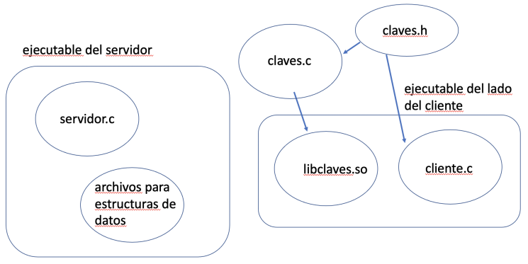

# Ejercicio Evaluable 2: Sockets TCP
By Luis Daniel Casais Mezquida & Lucía María Moya Sans  
Sistemas Distribuídos 22/23  
Bachelor's Degree in Computer Science and Engineering, grp. 89  
Universidad Carlos III de Madrid

## Descripción del ejercicio
Se desea diseñar e implementar un servicio distribuido (utilizando colas de mensajes POSIX) que permite almacenar tuplas `<clave-valor1-valor2-valor3>`. La clave será un número entero (`int`) y los valores asociados a la clave serán: una cadena de caracteres de cómo mucho 255 caracteres (excluido el código `0` que permite indicar el fin de la cadena), un número entero (`int`) y un número en coma flotante de doble precisión (`double`). Esta aplicación constará de un servidor que almacenará y gestionará las claves y de un API (Application Programming Interface) que permitirá a los procesos cliente del sistema hacer uso de los siguientes servicios:

- `int init()`: Esta llamada permite inicializar el servicio de elementos `clave-valor1-valor2-valor3`. Mediante este servicio se destruyen todas las tuplas que estuvieran almacenadas previamente. La función devuelve `0` en caso de éxito y `-1` en caso de error.
- `int set_value(int key, char *value1, int value2, double value3)`: Este servicio inserta el elemento `<key, value1, value2, value3>`. El servicio devuelve `0` si se insertó con éxito y `-1` en caso de error. Se considera error, intentar insertar una clave que ya existe previamente. En este caso se devolverá `-1` y no se insertará. También se considerará error cualquier error en las comunicaciones.
- `int get_value(int key, char *value1, int *value2, double *value3)`: Este servicio permite obtener los valores asociados a la clave `key`. Los valores se devuelven en `value1`, `value2` y `value3`. La función devuelve `0` en caso de éxito y `-1` en caso de error, por ejemplo, si no existe un elemento con dicha clave o si se produce un error de comunicaciones.
- `int modify_value(int key, char *value1, int value2, double value3)`: Este servicio permite modificar los valores asociados a la clave key. La función devuelve `0` en caso de éxito y `-1` en caso de error, por ejemplo, si no existe un elemento con dicha clave o si se produce un error en las comunicaciones.
- `int delete_key(int key)`: Este servicio permite borrar el elemento cuya clave es `key`. La función devuelve `0` en caso de éxito y `-1` en caso de error. En caso de que la clave no exista también se devuelve `-1`.
- `int exist(int key)`: Este servicio permite determinar si existe un elemento con clave key. La función devuelve `1` en caso de que exista y `0` en caso de que no exista. En caso de error se devuelve `-1`. Un error puede ocurrir en este caso por un problema en las comunicaciones.
- `int copy_key(int key1, int key2)`. Este servicio crea e inserta una nueva clave (`key2`) copiando los valores de la clave `key1` en la nueva clave creada (`key2`). En caso de que `key1` no exista se devolverá `-1` y no se creará la nueva clave. Si la clave `key2` no existe, se creará y se copiarán los valores de `key1` en `key2`. En caso de que la clave `key2` exista, se modificarán sus valores a partir de los de `key1`. La función devuelve `0` en caso de poder crear y copiar los nuevos datos en `key2` y `-1` en cualquier otro caso.

Tenga en cuenta para las llamadas anteriores que también se considera error, por ejemplo, que se produzca un error en el sistema de paso de mensajes (colas inexistentes, errores al enviar datos a una cola, errores al recibir datos de las colas, etc.). También se considerará error y se devolverá `-1` sin necesidad de contactar con el servidor, en caso de que a las llamadas anteriores se pasen cadenas de más de 256 caracteres para el valor `value1`.  

Todas las operaciones anteriores deben realizarse de forma atómica en el servidor.  

Diseñe e implemente, utilizando exclusivamente colas de mensajes POSIX y el lenguaje de programación C, el sistema que implemente este servicio de elementos `clave-valor1-valor2`. Para ello debe:

1. Desarrollar el código del servidor ([`servidor.c`](src/servidor.c)) encargado de gestionar las estructuras de datos que almacenan los elementos `clave-valor1-valor2-valor3`. Puede elegirse la estructura de datos que se estime oportuno, siempre que no imponga un límite en el número de elementos que se pueden almacenar. El servidor desarrollado debe ser concurrente.
2. Desarrollar el código que implementa los servicios anteriores (`init`, `set_value`, `get_value`, `delete_key`, `modify_value`, `exist`, y `copy_key`). El código se desarrollará sobre el archivo con nombre [`claves.c`](src/lib/claves.c). Este es el código que ofrece la interfaz a los clientes y se encarga de implementar los servicios anteriores (del lado del cliente) contactando con el servidor anterior. A partir de dicha implementación se deberá crear una biblioteca dinámica denominada `libclaves.so`. Esta será la biblioteca que utilizarán las aplicaciones de usuario que para usar el servicio. Debe investigar y buscar la forma de crear dicha biblioteca.
3. Desarrollar un ejemplo de código de un cliente ([`cliente.c`](src/cliente.c)) que utilice las funciones anteriores. El ejecutable de este programa tiene que generarse empleando la biblioteca desarrollada en el apartado anterior, es decir, el código de este cliente debe enlazarse con la biblioteca dinámica anterior. Este cliente se utilizará para probar el servicio desarrollado y deberá realizar las invocaciones al API de tuplas que considere oportuno. El código incluido en [`cliente.c`](src/cliente.c) solo podrá incluir llamadas a los servicios implementados y descritos anteriormente. En él no puede haber ninguna referencia a colas de mensajes.
4. Elaborar un plan de pruebas del servicio desarrollado ([`test.c`](src/test.c)). Este plan se probará con el código desarrollado en el apartado anterior.

La estructura del código a desarrollar se muestra en la siguiente figura:  



Para el almacenamiento de los elementos `clave-valor1-valor2-valor3` puede hacer uso de la estructura de datos o mecanismo de almacenamiento que considere más adecuado, el cual describirá en la memoria entregada. La estructura elegida no debe fijar un límite en el número de elementos que se pueden almacenar. Puede utilizarse la misma implementación realizada en el [ejercicio 1](https://github.com/ldcas-uc3m/SSDD-Ex1).  

El punto de partida para el desarrollo de este ejercicio es el [ejercicio 1](https://github.com/ldcas-uc3m/SSDD-Ex1) y el código desarrollado en el [laboratorio 3](https://github.com/ldcas-uc3m/SSDD-Labs/tree/main/lab3) dedicado a los sockets.  

Se recomienda probar el servidor con varios clientes de forma concurrente. 

### Aclaraciones adicionales
La memoria debe indicar el diseño realizado y el protocolo de aplicación seguido en la comunicación entre [`claves.c`](src/lib/claves.c) y el servidor. Tenga en cuenta que el diseño y el protocolo definido tiene que ser independiente del lenguaje de programación utilizado finalmente. Por tanto, aunque en este ejercicio se utiliza C para el cliente y el servidor, la solución no debe incluir el envío por un socket de estructuras de C ni cualquier otro elemento dependiente de este lenguaje de programación, ya que esto haría que la solución no fuera independiente.  

En este ejercicio la biblioteca a desarrollar tiene que conocer la dirección IP y el puerto del servidor que ofrece el servicio de tuplas. Para evitar tener una dirección físicamente programada en el código y no tener que pasar la IP y el puerto en la línea de mandatos del programa cliente, se va a considerar que tanto la dirección IP como el puerto se van a pasar utilizando dos variables de entorno:
- `IP_TUPLAS`: variable de entorno que define la IP del servidor.
- `PORT_TUPLAS`: variable de entorno que define el puerto del servidor de tuplas.

Estas variables de entorno habrán de definirse en cada terminal donde se ejecute el cliente. Para definir una variable de entorno denominada `VAR1` con valor `hola` habrá que especificar en la consola:
```bash
export VAR1=hola
```

A continuación, se muestra un ejemplo de programa que es capaz de acceder al valor de dicha variable de entorno. Tenga en cuenta que la variable de entorno se devuelve como una cadena de caracteres.

```c
#include <stdio.h>
#include <stdlib.h>
int main() {
    char *var;
    var = getenv("VAR1");
    if (var == NULL){
        printf("Variable VAR1 no definida\n");
        return 0;
    }
    else
        printf("Variable VAR1 definida con valor %s\n", var);
    return 0;
}
```

Para conocer la lista de variables de entorno definidas es necesario ejecutar en la consola:
```bash
env
```

Para poder ejecutar el cliente será necesario definir las variables de entorno `IP_TUPLAS` y `PORT_TUPLAS` utilizando el comando `export` indicado anteriormente. Una forma alternativa de pasar los valores de estas dos variables de entorno al programa cliente es ejecutando este programa de la siguiente forma:
```bash
env IP_TUPLAS=localhost PORT_TUPLAS=8080 ./cliente
```

En cuanto al servidor, el puerto se le pasará como un argumento en la línea de mandatos de la siguiente
forma:
```bash
./servidor <PUERTO>
```
Por ejemplo:
```bash
./servidor 4500
```
Especificará que el servidor aceptará peticiones de los clientes en el puerto `4500`.


## Instalación y ejecución

Compila con make:
```bash
cd src/
make
```

Al usar una librería dinámica, debes enlazarla:
```bash
export LD_LIBRARY_PATH=lib/
```

Para ejecutar en el puerto `8080`, por eg.:
```bash
./servidor 8080
```

```bash
export IP_TUPLAS=localhost
export PORT_TUPLAS=8080

./cliente
```